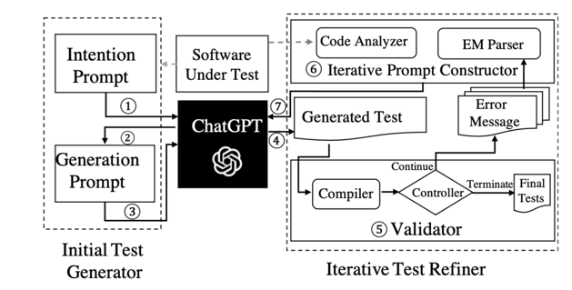

# Evaluating and Improving ChatGPT for Unit Test Generation

ChatTester is a framework designed for generating test methods automatically based on large models such as ChatGPT.



# ChatTester Experiment Guide

## Environment Requirements
To run this experiment successfully, ensure that the following environment requirements are met:
- Python version >= 3.7
- JDK version = jdk1.8.0_131

## Code Execution
To reproduce the effectiveness of ChatTester on the project, follow these steps:

1. Navigate to the `./ExperimentCode` directory.
2. Run the `InitialPhrase_Experiment.py` file.
   - Note: When running this `.py` file, make sure to set up your JDK environment and `open_key` (marked with TODO).
   - The functionality implemented by `InitialPhrase_Experiment` corresponds to the "Initial Test Generator" in the figure.

3.  Run the `ChatGptTester.py` file located in the `./ExperimentCode` directory.
    - This file implements the functionality of the "Iterative Test Refiner" in the figure.

4. After running the experiment, you can find the test methods generated by ChatTester for the given project in the `./ExperimentCode/IterateResultDeal` directory.

## Calculating Test Method Coverage
To calculate the coverage of the generated test methods in each project, follow these steps:

1. Navigate to the `CoverageCal` directory.
2. Run the `Mergy.py` file. This action will place the generated test methods in the respective project directories.
3. Then, run the `jacoco.py` script located in the `./script` directory. This script utilizes Jacoco to calculate the coverage of the generated test methods in each project.

# Additional Experiments Data
Additional experimental data related to this paper can be found at the following link: [ChatTESTER.git](https://github.com/yz-qiang/ChatTESTER/tree/master)


# Citation
```
@misc{yuan2023manual,
      title={No More Manual Tests? Evaluating and Improving ChatGPT for Unit Test Generation}, 
      author={Zhiqiang Yuan and Yiling Lou and Mingwei Liu and Shiji Ding and Kaixin Wang and Yixuan Chen and Xin Peng},
      year={2023},
      eprint={2305.04207},
      archivePrefix={arXiv},
      primaryClass={cs.SE}
}
```